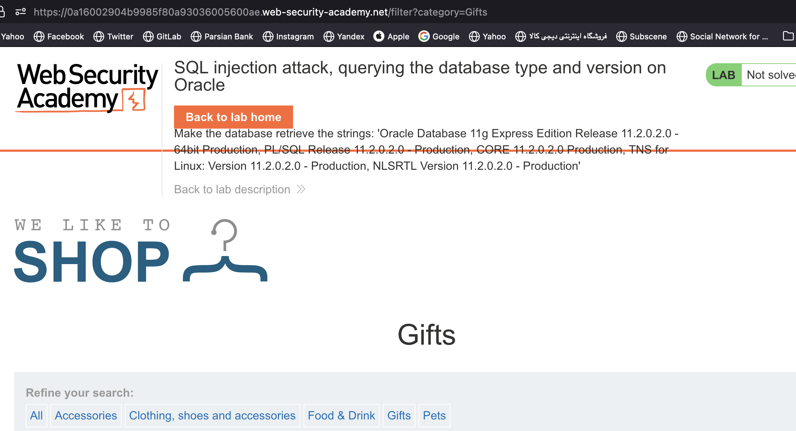
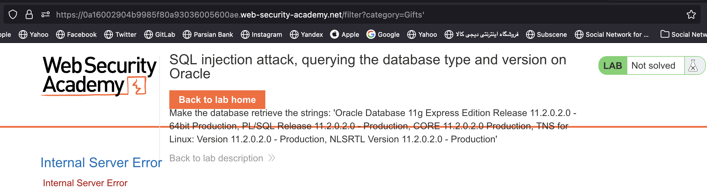
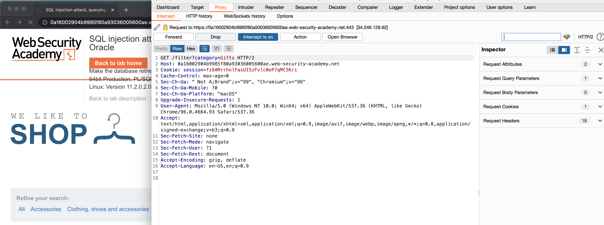
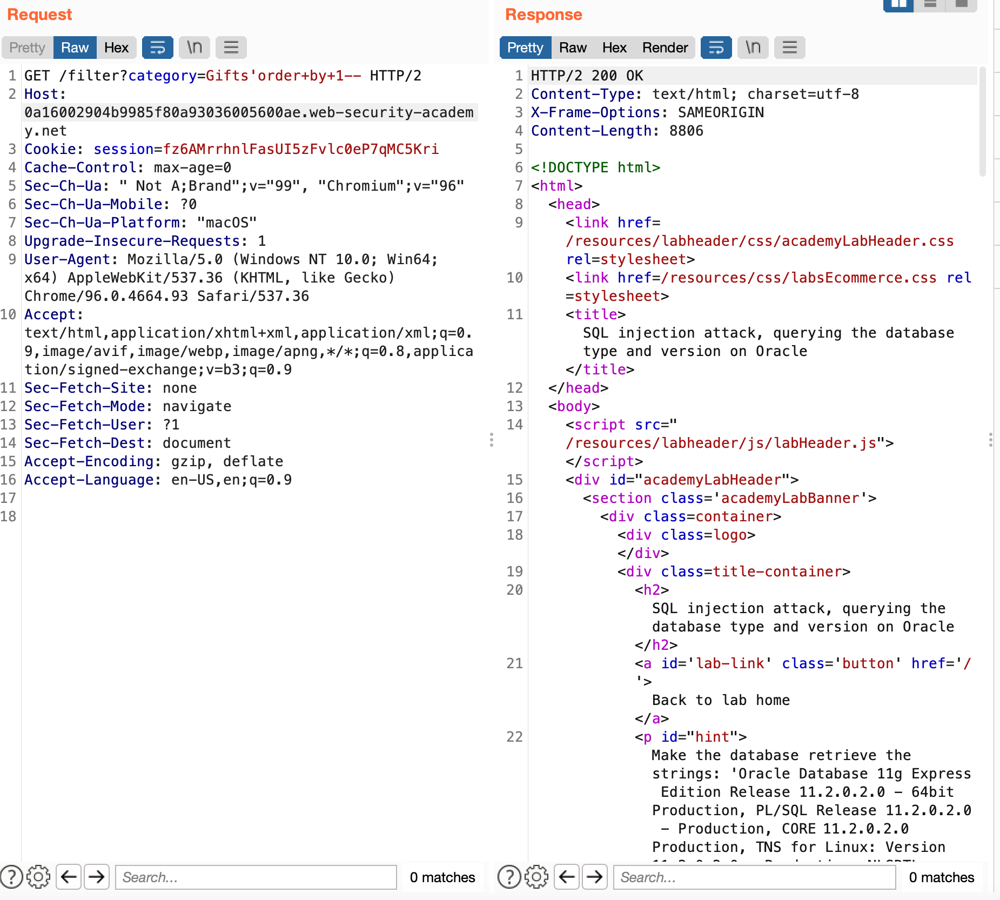
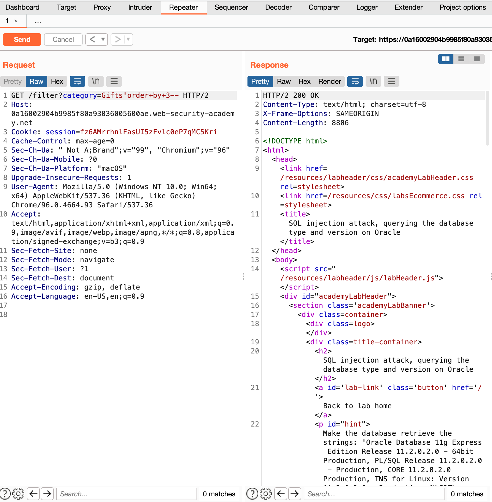
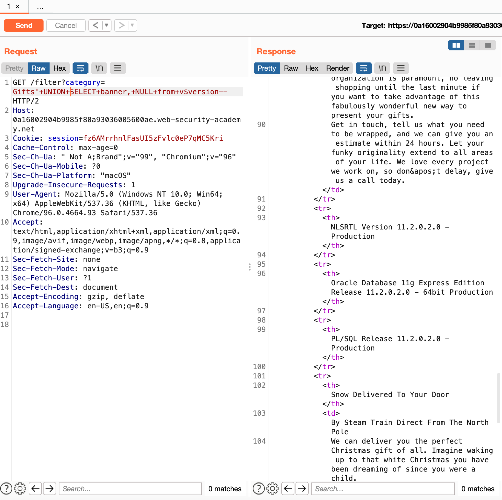
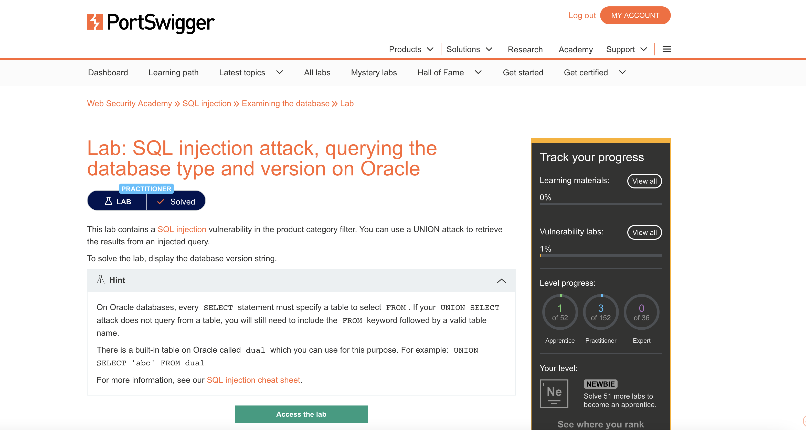

# web-security-academy-sql-injection-attack-querying-the-database-type-and-version-on-oracle

This repository is solution to assignment on Data Security Course. It is a portswigger [Lab](https://portswigger.net/web-security/sql-injection/examining-the-database/lab-querying-database-version-oracle) which was assigned to me to solve.

# Description

 This lab contains a SQL injection vulnerability in the product category filter. You can use a UNION attack to retrieve the results from an injected query.

To solve the lab, display the database version string.

# Solution

First we navigate go to page 'Gifts' page and observe the paramtere sent by http resquest. as we can see i hast category parameter

now we use single quote to see if server send  internal error or not.

No we can obserev the request on proxy, as we wantto send several request, we send it to repeater.

So we add and SQL command to our category parameter to observe the vulnerability and the table has 2 columns

Do it with 3 columns.

No let's get database version. We add `'+UNION+SELECT+banner,+NULL+from+v$version-- ` to be performed on database as the helper on site's cheat sheet mentioned

# Result

Lab is solved.

